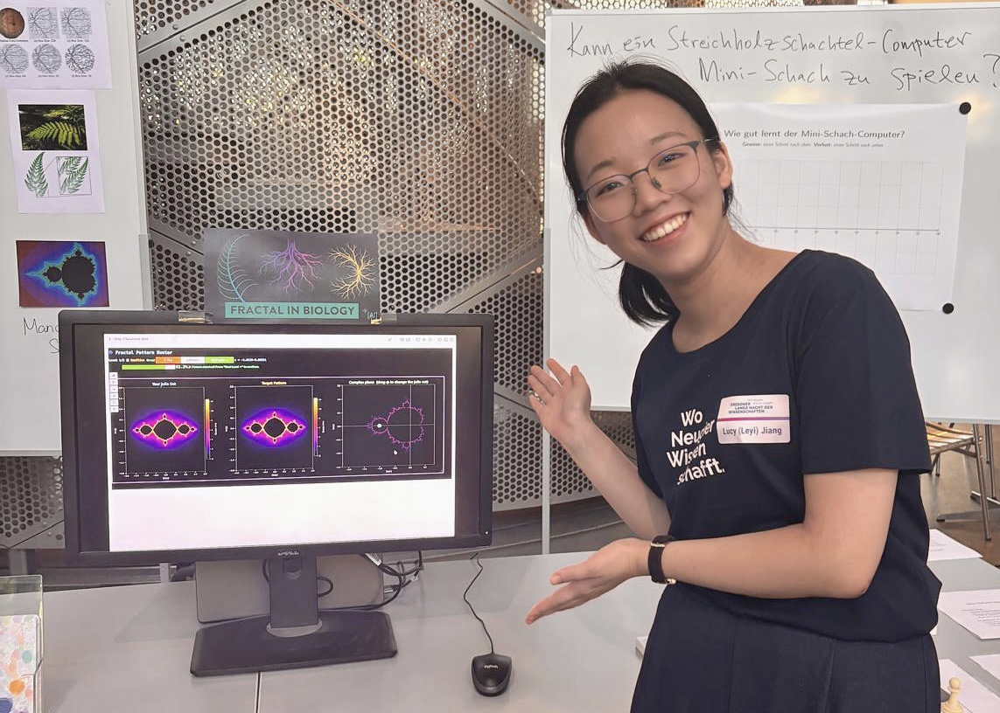
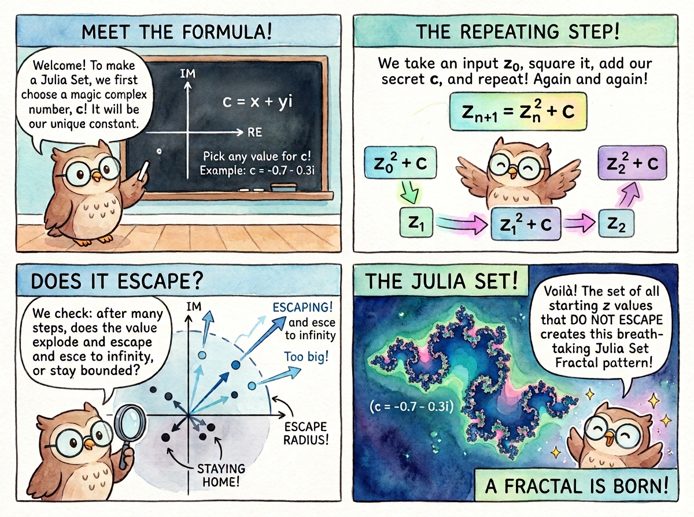

> "Mathematics, rightly viewed, possesses not only truth, but supreme beauty."   
> -- -- Bertrand Russell

My very first mathematical coding project was writing a MATLAB script to render Julia sets. There was something magical about seeing complex dynamics transform abstract numbers into intricate, infinite patterns on a screen.

Fractal Pattern Hunter was born out of a desire to recreate that sense of wonder and share it with others. The goals are simple:

1. Show how beautiful math can be through immediate visual feedback.
2. Empower players to create their own intricate patterns interactively.
3. Build mathematical intuition by turning exploration into a puzzle game.

## How to Play

Drag the cyan point across the complex plane to watch your Julia set transform in real time. Your goal is to match the target pattern on the left—reach at least 80% similarity to unlock the next level!



## Learning Through Playing

As players navigate through levels to match the target pattern, the game encourages them to develop geometric intuition:

- Shape & Topology: Observing how continuous shifts in $c$ cause the set to pinch, split into disconnected dust, or bloom into connected structures.
- Symmetry & Rotation: Exploring how moving across the real and imaginary axes affects the horizontal and rotational symmetry of the generated set.
- The Mandelbrot Connection: Noticing how picking points inside the main cardioid or bulb yields connected Julia sets, while moving outside creates Cantor dust.

Fractal Pattern Hunter was presented at the Mathematics for Biology booth during the [Dresden Long Night of Science](https://www.wissenschaftsnacht-dresden.de/) on June 26, 2026. Thanks to everyone that had a go at it! 

## How It Works

### Generating a Julia Set

Think of a Julia set as a simple repeat-and-check rule for numbers.

You pick a starting complex number $c$ by moving the cyan dot. The computer takes points across the screen ($z$) and runs them through a simple loop over and over:

$$
z = z^2 + c
$$

If a point's value shoots off to infinity, it gets colored based on how fast it escapes. If it stays bounded forever, it gets colored black. Every single point on the complex plane gets its own Julia set pattern. Change $c$ even a tiny bit, and the entire landscape changes.

### The Mandelbrot Set

The map on the right where you drag the cyan dot is the Mandelbrot set. It acts as a control panel for all possible Julia sets. Choosing a $c$ inside the Mandelbrot set creates a single, connected Julia set. Choosing a $c$ outside causes the Julia set to shatter into infinitely many tiny, disconnected pieces (often called "fractal dust").

